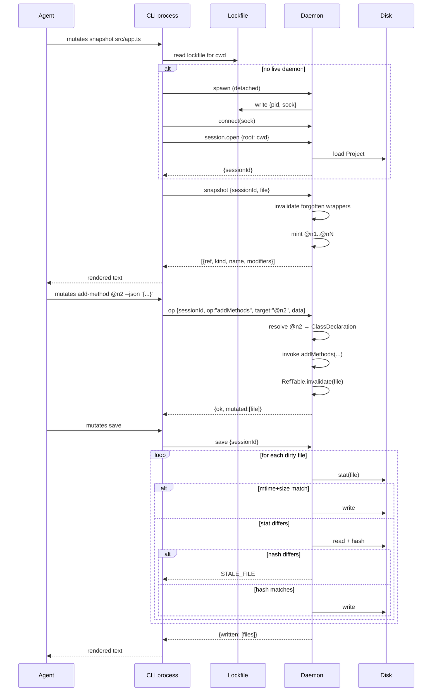

# Design Document: @mutates/cli

## Overview

`@mutates/cli` is a new package in the monorepo that ships the `mutates`
binary. It wraps `@mutates/core` as a long-lived-daemon CLI modelled on
`agent-browser`. The CLI is a thin client; a daemon process per project
root owns a single ts-morph `Project`, mints `@nN` refs, applies
mutations in memory, and saves with mtime+size conflict detection.
Operation commands are code-generated from `@mutates/core`'s public API
using ts-morph itself (dogfood).

### Key Changes

1. New workspace package `packages/cli` producing the `mutates` bin.
2. A daemon process (Node child) that holds the active `ts-morph`
   `Project` for one project root, listens on a Unix domain socket /
   Windows named pipe, and speaks JSON-RPC 2.0 over NDJSON.
3. A codegen step that reads `@mutates/core`'s exported `add* / edit* /
   remove* / get*` functions and emits both citty subcommand definitions
   and daemon-side operation handlers.
4. Embedded skill markdown (`mutates skills get core`) generated from
   `packages/cli/skills/*.md` into a TS module at build time.

### Chosen Approach

| Problem Area | Chosen Solution | Reference |
|---|---|---|
| Daemon + IPC + discovery | Unix socket + JSON-RPC NDJSON | research.md §1 |
| CLI framework | citty | research.md §2 |
| Node refs | `WeakRef` + sequential IDs, invalidated on mutation | research.md §3 |
| FS conflicts | mtime + size at save preflight (hash fallback) | research.md §4 |
| Skill markdown | Codegen `.md` → `.ts` | research.md §5 |

### Resolutions for Open Questions

| Question | Resolution |
|---|---|
| Process-per-session vs explicit-project refactor of core | **Process-per-session.** Each daemon owns one Project; `@mutates/core`'s `getActiveProject()` singleton stays untouched. Multi-session = multiple daemons. Memory cost is bounded by the number of project roots an agent works on concurrently (typically 1–2). |
| JSON-RPC framing | **NDJSON.** One JSON object per line. No payloads contain newlines (we control serialization). LSP-style `Content-Length` is reserved for future binary support. |
| Idle timeout default | **600 s (10 min).** Override via `MUTATES_IDLE_TIMEOUT=<seconds>` or `--idle-timeout`. Reset on every dispatched RPC. |
| Hash fallback after mtime mismatch | **Yes — xxhash64 on mismatch.** Cheap (only computed when stat already disagrees); eliminates formatter/`touch` false positives at near-zero cost on the happy path. |
| Generated `skills.ts` — commit or ignore | **Gitignore.** `packages/cli/src/generated/` is `.gitignore`d. The build step always regenerates; CI verifies clean regen. |
| Codegen authority | **ts-morph itself.** `scripts/gen-commands.ts` opens a Project pointing at `packages/core`, walks exported declarations, and emits citty commands + handler dispatch table. Same library, same toolchain. |

## Architecture

### Component Diagram

```mermaid
graph TB
    subgraph Agent[AI agent / human shell]
        AG[shell: mutates ...]
    end

    subgraph CLIProcess["CLI process (short-lived)"]
        ENTRY[bin/mutates.ts<br/>citty root]
        CMDS[generated commands<br/>add-class, edit-method, ...]
        CLIENT[RpcClient<br/>discover + connect]
        FMT[OutputFormatter<br/>text / --json]
    end

    subgraph LockDir["~/.cache/mutates/sessions/"]
        LF[<rootHash>.json<br/>pid + sockPath]
    end

    subgraph DaemonProcess["Daemon process (one per project root)"]
        SVR[net.Server<br/>NDJSON / JSON-RPC]
        DISP[Dispatcher]
        SESS[Session<br/>owns ts-morph Project]
        REFS[RefTable<br/>WeakRef map]
        SNAP[Snapshot renderer]
        OPS[Operation handlers<br/>generated]
        FSCK[FileStatCache]
    end

    CORE[(@mutates/core)]
    DISK[(file system)]

    AG --> ENTRY
    ENTRY --> CMDS
    CMDS --> CLIENT
    CLIENT -.read.-> LF
    CLIENT <-->|spawn + connect| SVR
    CLIENT --> FMT

    SVR --> DISP
    DISP --> SESS
    SESS --> REFS
    SESS --> SNAP
    SESS --> OPS
    SESS --> FSCK
    OPS --> CORE
    SESS --> DISK
    LF -. written by .- DaemonProcess
```

### Data Flow — typical agent loop (`snapshot` → mutate → `save`)



## Components and Interfaces

### Package layout

```
packages/cli/
├── bin/
│   └── mutates.ts                 # citty root, runMain
├── skills/
│   └── core.md                    # source-of-truth markdown
├── scripts/
│   ├── gen-commands.ts            # ts-morph reads core, emits commands + dispatch
│   └── gen-skills.ts              # emits src/generated/skills.ts from skills/*.md
├── src/
│   ├── commands/
│   │   ├── core/                  # hand-written: open, close, sessions, snapshot,
│   │   │   ├── open.ts            # find, diff, save, reload, schema, skills
│   │   │   ├── snapshot.ts
│   │   │   └── ...
│   │   └── generated/             # gitignored; emitted by gen-commands
│   │       ├── classes/add.ts
│   │       └── ...
│   ├── client/
│   │   ├── rpc-client.ts          # NDJSON over net.Socket; discovery + spawn
│   │   └── output.ts              # text / --json renderer
│   ├── daemon/
│   │   ├── entry.ts               # daemon bin; net.Server + dispatcher loop
│   │   ├── dispatcher.ts          # method-name → handler
│   │   ├── session-manager.ts     # opens, closes, idle-timeout
│   │   └── handlers/
│   │       ├── snapshot.ts
│   │       ├── save.ts
│   │       └── generated/         # gitignored; emitted by gen-commands
│   ├── session/
│   │   ├── session.ts             # owns Project + RefTable + FileStatCache
│   │   ├── ref-table.ts
│   │   ├── snapshot.ts            # AST walker → entries
│   │   └── file-stat-cache.ts
│   ├── proto/
│   │   ├── jsonrpc.ts             # framing, request/response types
│   │   └── error-codes.ts
│   ├── discovery/
│   │   └── lockfile.ts            # ~/.cache/mutates/sessions/<hash>.json
│   ├── generated/                 # gitignored
│   │   ├── skills.ts
│   │   └── op-schemas.ts          # JSON Schemas for `mutates schema`
│   └── skills/
│       └── index.ts               # facade over generated/skills.ts
└── package.json
```

### RpcClient

```ts
// src/client/rpc-client.ts

interface RpcClient {
  /**
   * Resolve a daemon for the given project root, auto-spawning if none lives.
   * Honours --session override.
   */
  connect(opts: { root: string; sessionId?: string }): Promise<Connection>;
}

interface Connection {
  call<R>(method: string, params: unknown): Promise<R>;
  close(): Promise<void>;
}
```

Discovery: `lockfile.path(root)` returns
`~/.cache/mutates/sessions/<sha256(absolute-root):0..16>.json`. The
client reads `{ pid, sock, version }`; if `process.kill(pid, 0)` fails
or the socket isn't connectable, the lockfile is treated as stale and
the client spawns a new daemon. Spawn is `child_process.spawn(node,
[daemonEntry, '--root', root], { detached: true, stdio: 'ignore' })`
followed by a 2-second connect-with-retry loop.

Windows path: `\\.\pipe\mutates-<hash>`. The `net` module accepts the
same `path` parameter; one code path.

### JSON-RPC protocol (NDJSON over Unix socket / named pipe)

Methods exposed by the daemon:

| Method | Params | Result |
|---|---|---|
| `session.open` | `{ root: string }` | `{ sessionId, tsconfig: string \| null, idleTimeoutMs }` |
| `session.close` | `{ sessionId }` | `{ ok: true }` |
| `session.list` | `{}` | `Array<{ id, root, ageMs, unsavedFiles: number }>` |
| `snapshot` | `{ sessionId, target: { file: string } \| { ref: string }, mode?: "top" \| "drill" }` | `Snapshot` |
| `find` | `{ sessionId, kind: string, query: Record<string, unknown> }` | `Array<NodeSummary>` |
| `op` | `{ sessionId, op: string, target: TargetSpec, data: unknown }` | `{ ok: true, mutated: string[] }` |
| `diff` | `{ sessionId, file?: string }` | `Array<{ file, unified, before?, after? }>` |
| `save` | `{ sessionId, file?: string, dryRun?: boolean }` | `{ written: string[] } \| { wouldWrite: { file, bytes }[] }` |
| `reload` | `{ sessionId, file: string }` | `{ result: "noChange" \| "updated" \| "deleted" }` _(post-MVP per Req 7.3 — protocol slot reserved)_ |
| `listFiles` | `{ sessionId, glob?: string }` | `Array<{ file, dirty: boolean }>` |

Framing: one JSON object per line, UTF-8, no embedded `\n`. Each frame
is a JSON-RPC 2.0 request, response, or error:

```jsonc
// request
{"jsonrpc":"2.0","id":1,"method":"snapshot","params":{...}}
// success response
{"jsonrpc":"2.0","id":1,"result":{...}}
// error response
{"jsonrpc":"2.0","id":1,"error":{"code":-32001,"message":"STALE_REF","data":{...}}}
```

Error codes (mapped to CLI exit codes):

```ts
// src/proto/error-codes.ts
export const ErrorCode = {
  // JSON-RPC reserved
  ParseError:        -32700,
  InvalidRequest:    -32600,
  MethodNotFound:    -32601,
  InvalidParams:     -32602,
  InternalError:     -32603,
  // mutates-specific
  SessionNotFound:   -32001,
  StaleRef:          -32002,
  StaleFile:         -32003,
  NotFound:          -32004,
  IoError:           -32005,
  InvalidInput:      -32602, // alias of JSON-RPC InvalidParams
} as const;
```

The CLI surface uses the symbolic name on stderr (`{ "code":
"STALE_REF", "message": ..., "details": ... }`) per Req 8.3; the
numeric code stays inside the JSON-RPC envelope.

### Session

```ts
// src/session/session.ts
import { Project } from 'ts-morph';

interface SessionOptions {
  root: string;
  idleTimeoutMs: number;
}

class Session {
  readonly id: string;
  readonly root: string;
  readonly project: Project;
  readonly refs: RefTable;
  readonly stats: FileStatCache;

  constructor(opts: SessionOptions);

  /** Touch idle timer; called on every dispatched RPC. */
  touch(): void;

  /** Force close: save+dispose disallowed if dirty unless `force`. */
  close(force?: boolean): Promise<void>;
}
```

The daemon process owns at most **one** `Session` at any time (one
project root per daemon — Req 10.1 satisfied by spawning a second
daemon for a second root). `Session.project` is a `ts-morph` `Project`
created without ever calling `createProject()` from `@mutates/core`, so
the singleton `getActiveProject()` is *not* engaged. The operation
handlers (next section) bind `setActiveProject(session.project)`
before each invocation and restore the previous value after — see
"Bridging `@mutates/core`'s singleton" below.

### RefTable

```ts
// src/session/ref-table.ts
import type { Node } from 'ts-morph';

interface NodeRef {
  id: number;          // sequential within a snapshot of a file
  file: string;        // absolute path
  kind: string;        // SyntaxKind name
}

class RefTable {
  /** Mint a ref for `node`. Returns the public `@nN` string. */
  mint(node: Node, file: string): string;

  /**
   * Resolve a ref string back to its Node.
   * - returns the live Node when valid
   * - throws StaleRefError when invalidated or when node.wasForgotten()
   */
  resolve(ref: string): { node: Node; file: string };

  /** Invalidate all refs that point into `file`. */
  invalidateFile(file: string): void;

  /** Reset all refs for `file` and start a new sequence. */
  resetFile(file: string): void;
}
```

Internal storage: `Map<string, { weak: WeakRef<Node>; file: string;
generation: number }>`. Each file owns a `generation` counter
(monotonic). On `mint`, a new ref's generation matches the file's
current generation; on `invalidateFile(file)`, the generation
increments; on `resolve`, the ref's generation is compared against the
current file generation, and `WeakRef.deref()` is checked plus
`node.wasForgotten()`. Any mismatch → `StaleRef`.

### Snapshot rendering

```ts
// src/session/snapshot.ts
interface SnapshotEntry {
  ref: string;                 // "@n3"
  kind: string;                // "class" | "function" | "import" | ...
  name?: string;               // declaration name when present
  modifiers?: string[];        // ["exported", "async", "default"]
  children?: number;           // count of children available via drill
}

interface SnapshotResult {
  file: string;
  entries: SnapshotEntry[];
}

function snapshotFile(session: Session, file: string): SnapshotResult;
function snapshotChildren(session: Session, parentRef: string): SnapshotResult;
```

Text rendering (default for human / agent):

```
File: src/app.ts
@n1 [import] from "rxjs" { of, map }
@n2 [class] AppService exported
@n3 [function] helper exported
```

JSON rendering (`--json`) returns `SnapshotResult` verbatim.

### FileStatCache

```ts
// src/session/file-stat-cache.ts
interface FileFingerprint {
  mtimeMs: number;
  size: number;
  hash?: string;        // populated lazily after mismatch
}

class FileStatCache {
  /** Record fingerprint at load time (or after a successful save). */
  record(file: string, fp: FileFingerprint): void;

  /**
   * Verify the on-disk file matches the recorded fingerprint.
   * Returns `{ ok: true }` when mtime+size match.
   * On mismatch, computes xxhash64; if it equals the recorded hash
   * (or content equals the in-memory text), returns `{ ok: true }`
   * and refreshes mtime+size silently.
   * Otherwise returns `{ ok: false, reason: 'StaleFile' }`.
   */
  verify(file: string, inMemory: string): Promise<{ ok: true } | { ok: false; reason: 'StaleFile' }>;
}
```

xxhash64 is provided by `xxhash-wasm` (~10kB, mature). It is only ever
computed on stat-mismatch, so a typical agent loop performs **zero**
hashes.

### Operation handlers and codegen

The dispatcher receives `op` requests; the `op` field selects a
handler from a generated table. Hand-written `op` handlers exist only
when the operation cannot be reduced to a pure call of a single
`@mutates/core` function (e.g., `addMethods` requires resolving a
parent ref to a `ClassDeclaration` first).

`scripts/gen-commands.ts` (run by Nx target `mutates-cli:gen`) opens
`packages/core` as a ts-morph project and walks exported declarations
matching `/^(add|edit|remove|get)[A-Z]/`. For each function it emits:

1. **A daemon handler** in
   `src/daemon/handlers/generated/<category>/<verb>.ts`:
   ```ts
   // GENERATED — do not edit
   import { addClasses } from '@mutates/core';
   import type { Handler } from '../../dispatcher';

   export const addClassesHandler: Handler = async (session, params) => {
     const { pattern, structures } = params;
     return session.withActiveProject(() => {
       addClasses(pattern, structures);
       return { ok: true, mutated: session.dirtyFiles() };
     });
   };
   ```

2. **A citty subcommand** in
   `src/commands/generated/<category>/<verb>.ts`:
   ```ts
   // GENERATED — do not edit
   import { defineCommand } from 'citty';
   import { withRpc } from '../../../client/rpc-client';

   export default defineCommand({
     meta: { name: 'add-classes', description: 'Add classes to source files matching a glob pattern' },
     args: {
       file: { type: 'string', description: 'Glob pattern' },
       ref:  { type: 'string', description: 'Node ref (alternative to --file)' },
       filter: { type: 'string', description: 'JSON filter for target nodes' },
       json: { type: 'string', description: 'Inline JSON payload (or "-" for stdin)', required: true },
       session: { type: 'string', description: 'Session id' },
     },
     run: withRpc(async ({ rpc, args }) => {
       const data = await readJson(args.json);
       return rpc.call('op', { op: 'addClasses', target: parseTarget(args), data });
     }),
   });
   ```

3. **A JSON Schema entry** in `src/generated/op-schemas.ts`, exposed
   via `mutates schema`.

The classifier for `target` shape is derived statically:

| Core signature shape | Target rule emitted |
|---|---|
| `(pattern: Pattern, structures: T)` | `--file <glob>` required |
| `(nodes: Node \| Node[], data: T)` | `@nN` or `--file + --filter` |
| `(query?: { pattern?, ... })` | `--filter` (optional) |
| `(declarations: Node[], editor)` | `@nN` or `--file + --filter`; `editor` collapses to JSON `Partial<Structure>` |

The full classifier rules live in
`scripts/gen-commands.ts` and are tested with snapshot tests against
the current core API.

### Bridging `@mutates/core`'s singleton

```ts
// src/session/session.ts (excerpt)
import { setActiveProject, resetActiveProject } from '@mutates/core';

withActiveProject<T>(fn: () => T): T {
  const prev = setActiveProject(this.project); // accept the unexported version we'd add
  try { return fn(); } finally {
    if (prev) setActiveProject(prev); else resetActiveProject();
  }
}
```

`@mutates/core` currently only exports `getActiveProject` /
`resetActiveProject` / `createProject` — `setActiveProject` is
module-private (`project.ts:7`). The MVP adds an explicit
`setActiveProject(project: Project): Project | null` export so the
CLI can drive the singleton without going through `createProject`.
This is the only required change to `@mutates/core`.

### Self-documentation (`mutates skills get core`)

`packages/cli/skills/core.md` is the source. `scripts/gen-skills.ts`
emits `src/generated/skills.ts`:

```ts
// GENERATED — do not edit
export const SKILLS = {
  core: "# mutates core\n…full markdown…",
} as const;
export type SkillName = keyof typeof SKILLS;
```

The hand-written `src/skills/index.ts` re-exports plus adds a manifest
of `{ name, description, sizeBytes }` for `mutates skills list`.

Escaping is handled by emitting via `JSON.stringify(content)` so
backticks and `${` are safe.

### CLI entry (citty)

```ts
// bin/mutates.ts
import { defineCommand, runMain } from 'citty';
import open from '../src/commands/core/open';
import snapshot from '../src/commands/core/snapshot';
// ... other hand-written core commands

const main = defineCommand({
  meta: { name: 'mutates', version: '0.1.0', description: 'AST mutation CLI for AI agents' },
  subCommands: {
    open, close: () => import('../src/commands/core/close').then(m => m.default),
    snapshot,
    save: () => import('../src/commands/core/save').then(m => m.default),
    diff: () => import('../src/commands/core/diff').then(m => m.default),
    find: () => import('../src/commands/core/find').then(m => m.default),
    schema: () => import('../src/commands/core/schema').then(m => m.default),
    skills: () => import('../src/commands/core/skills').then(m => m.default),
    sessions: () => import('../src/commands/core/sessions').then(m => m.default),
    // Operation commands — lazy, generated
    'add-classes': () => import('../src/commands/generated/classes/add').then(m => m.default),
    'edit-classes': () => import('../src/commands/generated/classes/edit').then(m => m.default),
    // …~56 more entries, generated into a single import map by gen-commands
  },
});

runMain(main);
```

The `subCommands` map itself is partially generated (operation
commands). All operation commands are lazy `import()` arrows, so a
`mutates --help` cold start touches only the citty root and the static
manifest — sub-millisecond load before connect overhead.

## Data Models

The CLI does not introduce persistent data. All in-memory state is
owned by `Session` and the lockfile.

### Lockfile

```ts
// ~/.cache/mutates/sessions/<rootHash>.json
interface SessionLockfile {
  version: 1;
  pid: number;
  sock: string;          // absolute socket path or named pipe
  root: string;          // absolute project root
  sessionId: string;     // opaque id (uuid v7)
  startedAt: number;     // ms since epoch
  cliVersion: string;
}
```

Cleanup: the daemon `unlink`s the lockfile on graceful shutdown.
Crashed daemons leave stale lockfiles; the client detects this via
`process.kill(pid, 0) → ESRCH` or a failed `net.connect`.

### Snapshot response (already shown above)

### Op request / response

```ts
type TargetSpec =
  | { ref: string }
  | { file: string; filter?: Record<string, unknown> };

interface OpRequest {
  sessionId: string;
  op: string;            // e.g. "addClasses"
  target: TargetSpec;
  data: unknown;         // shape determined by op (validated via JSON Schema)
}

interface OpResponse {
  ok: true;
  mutated: string[];     // absolute file paths whose in-memory state changed
}
```

## Data Flow Completeness

This feature has no database, schema migrations, or frontend. The
"per-field traceability" table from the spec template is rewritten as
"per-operation traceability" — for each `@mutates/core` exported
function, the four artifacts that must exist:

| Core function | Generated handler | Generated CLI command | JSON Schema |
|---|---|---|---|
| `addClasses` | `daemon/handlers/generated/classes/add.ts` | `commands/generated/classes/add.ts` | `op-schemas.addClasses` |
| `editClasses` | `…/classes/edit.ts` | `…/classes/edit.ts` | `op-schemas.editClasses` |
| `addMethods` | `…/methods/add.ts` | `…/methods/add.ts` | `op-schemas.addMethods` |
| `editMethods` | `…/methods/edit.ts` | `…/methods/edit.ts` | `op-schemas.editMethods` |
| _… one row per exported add\* / edit\* / remove\* / get\* …_ | | | |

Codegen failures (e.g., a new core function the classifier cannot
match) are CI-fatal — a snapshot test of the generated index files
exists exactly to surface this.

## Error Handling

Errors travel in JSON-RPC `error.code` and surface to the CLI as the
contract in Req 8.3.

| Source | Internal code | CLI surface (`code` on stderr) | Exit code | When |
|---|---|---|---|---|
| Lockfile / discovery | — | `SESSION_NOT_FOUND` | 4 | `--session <id>` not alive |
| Refs | `-32002` | `STALE_REF` | 5 | mutation invalidated ref or `node.wasForgotten()` |
| Save preflight | `-32003` | `STALE_FILE` | 6 | mtime+size AND hash mismatch |
| Args parsing | `-32602` | `INVALID_INPUT` | 2 | JSON parse fail / schema validation fail / missing arg |
| Core not-found | `-32004` | `NOT_FOUND` | 3 | filter matches zero nodes |
| FS I/O | `-32005` | `IO_ERROR` | 7 | EACCES, ENOENT on save, etc. |
| Anything else | `-32603` | `INTERNAL_ERROR` | 1 | unhandled |

Every error stderr payload has shape:

```json
{ "code": "STALE_REF", "message": "ref @n3 is stale; re-snapshot src/app.ts", "details": { "ref": "@n3", "file": "/abs/path/src/app.ts" } }
```

Daemon-side panics inside an RPC handler are caught at the dispatcher
and converted to `InternalError`; the daemon process does **not** exit.
A second uncaught error during the catch (rare) crashes the daemon;
the next CLI call observes a stale lockfile and respawns.

## Testing Strategy

### Approach

Three layers:

1. **Unit tests (vitest)** — RefTable, FileStatCache, lockfile parser,
   snapshot renderer, codegen classifier. Pure functions; fast.
2. **Daemon integration tests (vitest)** — spawn a daemon in-process
   (`createServer` + direct socket pair, no real subprocess), drive
   it with `RpcClient` against `InMemoryFileSystemHost` projects from
   `@mutates/core`'s testing utility. Covers session lifecycle, ref
   invalidation, save conflict, dry-run.
3. **End-to-end smoke tests (vitest + child_process)** — spawn the
   built `mutates` bin against a tmpdir project. Validates discovery,
   auto-spawn, real Unix socket, idle timeout (with short override).

### Unit Tests

```ts
// packages/cli/src/session/ref-table.spec.ts
describe('RefTable', () => {
  it('resolves a freshly minted ref to its Node', () => { /* … */ });
  it('returns StaleRef after invalidateFile for any ref in that file', () => { /* … */ });
  it('returns StaleRef when the underlying Node is forgotten', () => { /* … */ });
  it('mints fresh sequential ids per file', () => { /* … */ });
});
```

```ts
// packages/cli/src/session/file-stat-cache.spec.ts
describe('FileStatCache.verify', () => {
  it('passes when mtime and size match', async () => { /* … */ });
  it('escalates to hash when stat mismatches but content is identical', async () => { /* … */ });
  it('returns StaleFile when both stat and hash diverge', async () => { /* … */ });
});
```

```ts
// packages/cli/scripts/gen-commands.spec.ts
describe('command codegen classifier', () => {
  it('emits commands for every add* / edit* / remove* / get* export', () => { /* … */ });
  it('produces stable output (snapshot)', () => { /* … */ });
});
```

### Edge Cases

1. **Crashed daemon leaves stale lockfile** — Client detects via
   `process.kill(pid,0)` returning `ESRCH` or `net.connect` ECONNREFUSED;
   `unlink`s the lockfile and respawns.
2. **Two CLI invocations race to spawn the same daemon** — Daemon
   acquires the lockfile via `O_EXCL` create. Loser sees `EEXIST`,
   re-reads the lockfile, connects to the winner.
3. **`Node.wasForgotten()` after an intermediate API call we don't
   expect** — RefTable.resolve always checks. Any forgotten node maps
   to `STALE_REF` with the file name, prompting re-snapshot.
4. **Formatter touches the file** — mtime+size differ, hash matches,
   `FileStatCache.verify` returns ok and silently refreshes the
   fingerprint. Save proceeds.
5. **Project root not a TypeScript project (no tsconfig)** —
   `session.open` returns `tsconfig: null` and uses
   `Project({ useInMemoryFileSystem: false })` defaults; `--root`
   becomes the effective root.
6. **Idle timeout fires mid-save** — `save` calls `session.touch()`
   on entry; the timer resets before the long operation, so a
   mid-save timeout is not possible. Manual close during save: client
   call rejects with `InternalError`, in-memory state is lost.
7. **Massive snapshot** — Default `snapshot` is top-level only; drill
   via `@nN` returns immediate children only. Files with thousands of
   declarations naturally chunk.
8. **`@nN` referenced across processes** — Refs are session-scoped;
   passing them between two different CLI invocations against the
   same session is the intended pattern. Passing them between
   *different sessions* yields `STALE_REF`.

## Open Items Carried From Research

None. All six open questions from `research.md` are resolved in the
"Resolutions for Open Questions" table above.

## Next Steps

Ready for `spec:tasks mutates-cli` to break this design into tracked
implementation tasks.
